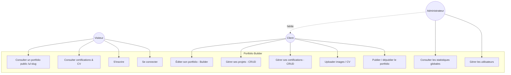
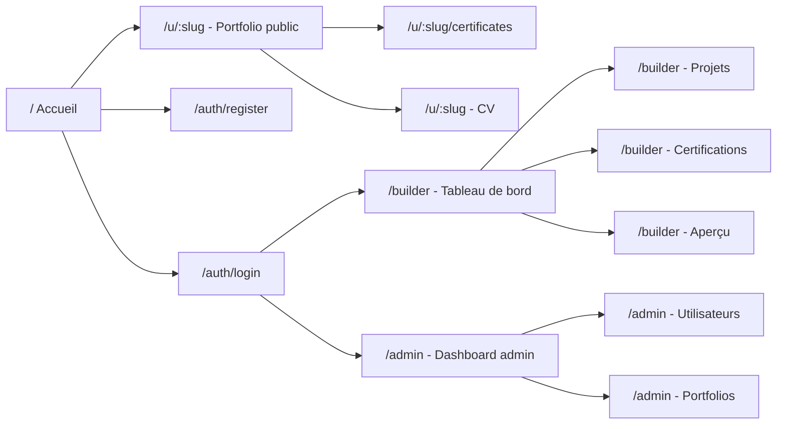
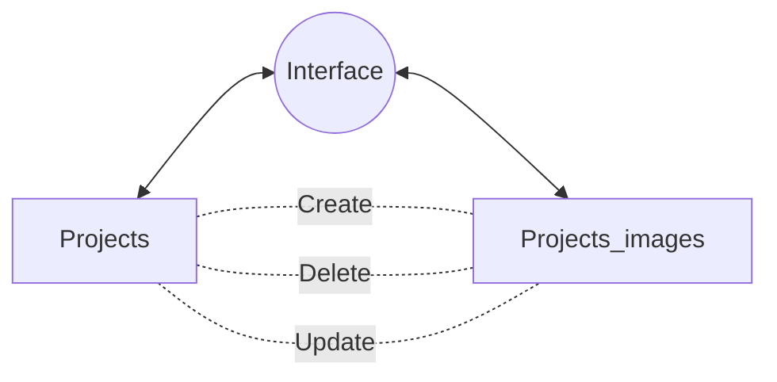
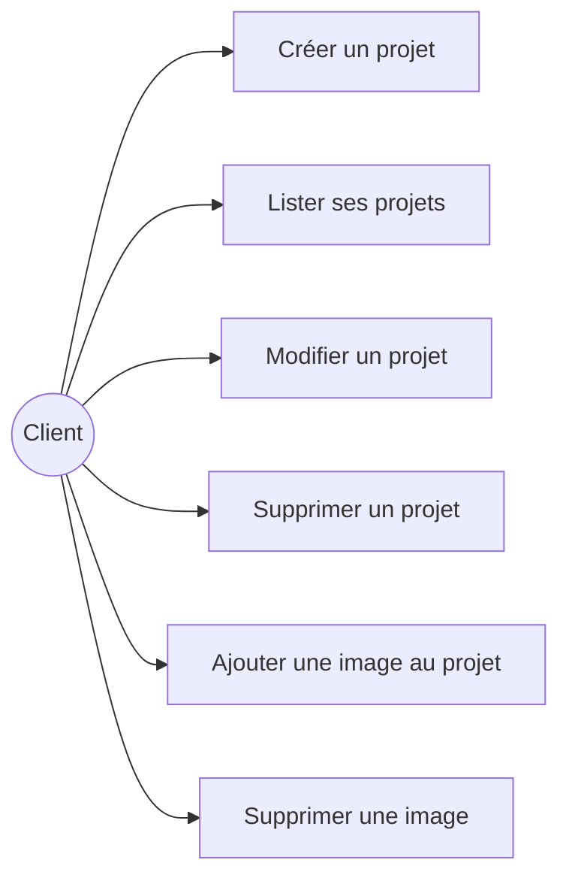
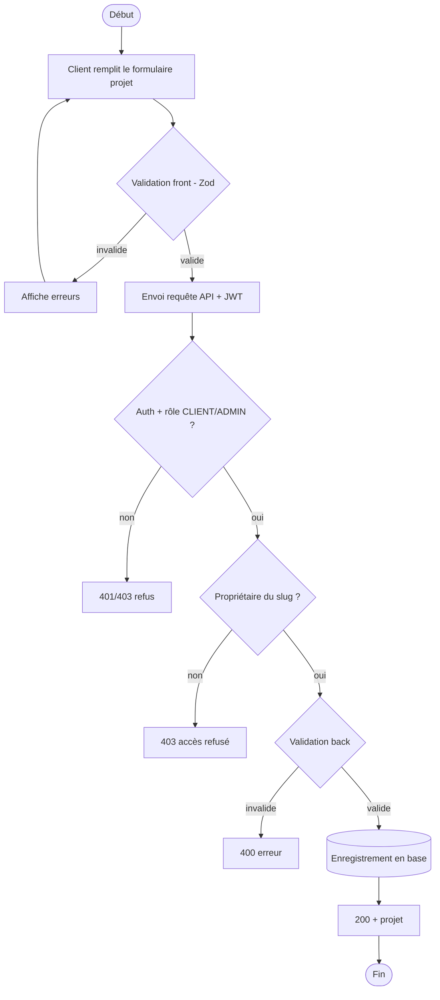
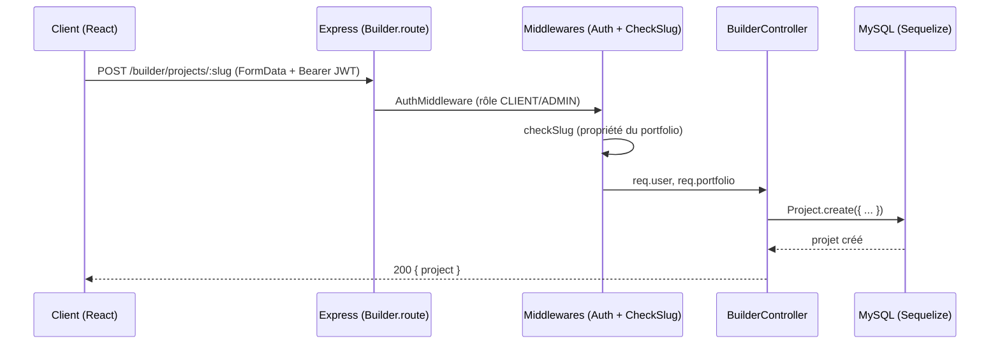
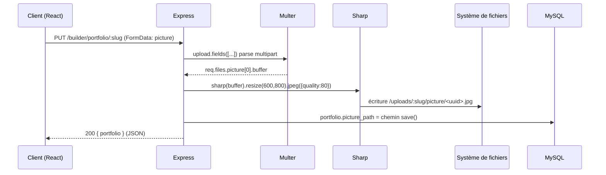
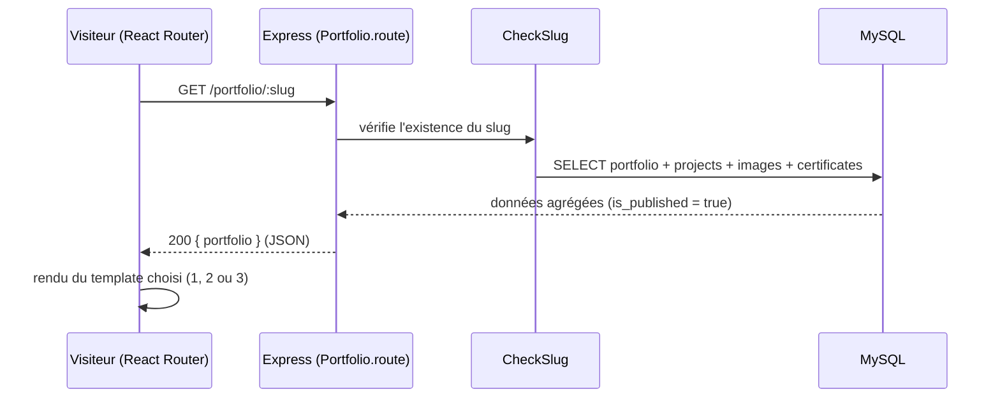
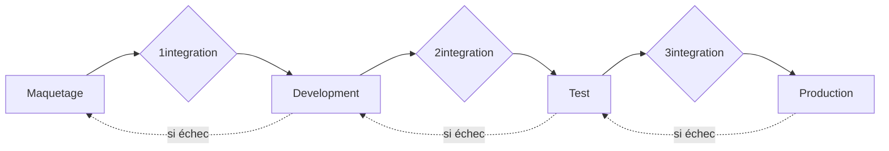

<!-- cover -->

<div class="text-center">

# **Portfolio Builder**  

### **Application web de création et publication de portfolios**
  ---

## Projet réalisé dans le cadre de la présentation au Titre Professionnel Développeur Web et Web Mobile

</div>

<div class="text-center" style="margin-top: 40mm">
</div>
<div class="text-center">

### Présenté par
## Joao Silva

</div>


<!-- /cover -->


<div class="text-center">

# Introduction générale
  
</div>


Ce dossier présente **Portfolio Builder**, une application web full-stack que j'ai conçue et
développée seul durant ma formation. Il retrace l'ensemble de la démarche, depuis l'analyse
du besoin jusqu'au déploiement, en passant par la conception, la modélisation de la base de
données et le développement front-end et back-end.

Trois fonctionnalités représentatives, "missions", seront détaillées plus loin pour
illustrer concrètement mes compétences :

1. **Mission n°1: CRUD :** la gestion des projets d'un portfolio dans le back-office (Builder).
2. **Mission n°2: API & asynchrone :** le pipeline d'upload et de traitement d'images.
3. **Mission n°3: Fonctionnalité avancée :** le rendu public d'un portfolio par *slug*.

\newpage


## 1. Présentation du projet

### 1.a. Contexte (projet personnel)

Portfolio Builder n'a pas été commandé par une entreprise : c'est un **projet personnel
réalisé au cours de ma formation DWWM**, sur mon temps de formation et mon temps libre. J'ai
travaillé seul, sur l'intégralité du cycle de développement.


### 1.b. Contexte du marché

Le marché des créateurs de sites et de portfolios est aujourd'hui dominé par des solutions
« tout-en-un » : **Wix, Squarespace, Carrd, Webflow** ou encore les profils **LinkedIn**.
Ces outils sont puissants mais génériques : ils ne sont pas pensés spécifiquement pour mettre
en valeur le travail d'un **développeur** (projets avec dépôt Git et démo en ligne, stack
technique, certifications). Ils sont par ailleurs souvent payants pour publier sur une adresse
propre, et imposent leur écosystème.

Portfolio Builder se positionne sur ce créneau précis : un générateur **simple, ciblé
développeurs**, où chaque portfolio expose naturellement des projets (lien du dépôt, lien de
démo, technologies, galerie d'images) et des certifications.

### 1.c. Quel est le besoin ?

Le besoin identifié est double :

- **Côté utilisateur final :** disposer rapidement d'un portfolio en ligne, esthétique et
  responsive, sans avoir besoin de coder ni maquetter, et pouvoir le mettre à jour facilement.
- **Côté besoin personnel (à l'origine du projet) :** je me suis moi-même heurté à la
  difficulté de créer mon portfolio. Plutôt que de résoudre ce problème une seule fois pour
  moi, j'ai décidé de le résoudre une bonne fois pour toutes en construisant l'outil.

### 1.d. Quel est l'historique ?

Le projet a démarré d'un constat simple et personnel (« comment faire mon propre portfolio ? »)
qui s'est transformé en problématique produit (« comment permettre à *n'importe qui* de faire
le sien ? »). J'ai donc itéré : d'abord l'authentification et le modèle de données, puis le
Builder (édition de contenu), puis le rendu public multi-templates, et enfin le back-office
d'administration.

---
\newpage
## 2. Équipe et gestion de projet

### 2.a. Méthodologie

Travaillant **seul**, j'ai adopté une approche **itérative et incrémentale** : je découpais le
projet en fonctionnalités livrables (authentification → modèle de données → Builder → rendu
public → admin), chacune développée, testée manuellement, puis intégrée avant de passer à la
suivante. Cette logique, proche d'un esprit **Kanban**, m'a permis de toujours
disposer d'une application fonctionnelle et de prioriser la valeur (un portfolio publiable le
plus tôt possible, le MVP, puis enrichissement progressif).

### 2.b. Outils utilisés

- **Git / GitHub**: pour le versionnement (dépôt unique, historique de commits).
- **GitHub Projects (Kanban)**: pour organiser les tâches en colonnes *À faire / En cours / Fait*.
- **VS Code**: comme environnement de développement.
  - **Extensions**:
    - **Prettier**: pour le formatage automatique du code.
    - **Tailwind CSS IntelliSense**: pour une aide sur la complétion des classes tailwind.
    - **Thunder Client** pour tester l'API.
- **MySQL Workbench**: pour inspecter la base de données.
 


<div class="text-center">


</div>


### 2.c. L'équipe

L'équipe se résume à un seul développeur full-stack (moi-même), qui a porté tous les rôles :
analyste, UX/UI designer, développeur front-end, développeur back-end, administrateur de base
de données et « ops » pour documenter le déploiement. Dans une organisation d'entreprise, ces rôles
seraient répartis entre un chef de projet (MOA), un lead developer, des développeurs front et
back, un designer UX/UI et un profil DevOps. En avoir assuré l'ensemble m'a permis de
comprendre concrètement l'articulation de ces métiers et la place du développeur dans la
chaîne de production logicielle.


\newpage

## 3. Spécifications fonctionnelles

### 3.a. Diagramme de cas d'utilisation (UML)

Trois acteurs : le **Visiteur** (anonyme), le **Client** (utilisateur authentifié qui édite
son portfolio) et l'**Administrateur**.


>voir annexe page 36


### 3.b. Cahier des charges & user stories

**Fonctionnalités attendues (cahier des charges synthétique) :**

| # | Fonctionnalité | Acteur |
|---|----------------|--------|
| F1 | Inscription / connexion sécurisées | Visiteur |
| F2 | Édition du contenu du portfolio (titre, présentation, identité, technos) | Client |
| F3 | Gestion des projets (créer / lire / modifier / supprimer + galerie d'images) | Client |
| F4 | Gestion des certifications (CRUD + image) | Client |
| F5 | Upload d'une photo de profil et d'un CV (PDF) | Client |
| F6 | Choix d'un template parmi plusieurs designs | Client |
| F7 | Publication à `/u/:slug` | Client |
| F8 | Visiter le rendu à `/u/:slug` | Visiteur |
| F9 | Tableau de bord d'administration (statistiques, gestion des comptes) | Admin |

**Exemples de user stories :**

- *En tant que* client, *je veux* ajouter un projet avec son lien GitHub, sa  galerie d'images, *afin de* mettre en valeur mes réalisations.
- *En tant que* client, *je veux* publier ou dépublier mon portfolio d'un clic, *afin de*
  contrôler sa visibilité.
- *En tant que* visiteur, *je veux* consulter un portfolio via une adresse simple, *afin de*
  découvrir le travail d'un développeur.
- *En tant qu'* administrateur, *je veux* voir des statistiques globales, *afin de* suivre
  l'activité de la plateforme.


\newpage
## 4. Spécifications techniques

### 4.a. Langages et versions

| Domaine | Langage / Runtime | Version |
|---------|-------------------|---------|
| Front-end | JavaScript (ES Modules), JSX | ES16(ECMAScript 2025) |
| Runtime serveur | Node.js | 24+ |
| Base de données | MySQL | 8+ |

### 4.b. Frameworks et outils de développement

**Front-end**

| Outil | Version | Rôle |
|-------|---------|------|
| React | 19.2 | Bibliothèque d'interfaces composant |
| Vite | 7.2 | Serveur de dev + bundler |
| React Router | 7.12 | Routage côté client |
| TanStack React Query | 5.90 | Gestion de l'état serveur (cache, refetch) |
| React Hook Form | 7.71 | Gestion performante des formulaires |
| Zod | 4.3 | Validation par schéma |
| Tailwind CSS | 4.2 | Mise en forme utilitaire |
| Axios | 1.13 | Client HTTP (intercepteurs JWT) |
\newpage
**Back-end**

| Outil | Version | Rôle |
|-------|---------|------|
| Express | 5.2 | Framework serveur HTTP |
| Sequelize | 6.37 | ORM (modèles, migrations, associations) |
| mysql2 | 3.16 | Driver MySQL |
| jsonwebtoken | 9.0 | Authentification par token JWT |
| bcrypt | 6.0 | Hachage des mots de passe |
| Multer | 2.1 | Réception des fichiers (multipart/form-data) |
| Sharp | 0.34 | Redimensionnement / conversion d'images |
| dotenv | 17 | Variables d'environnement |
| cors | 2.8 | Politique de partage des ressources |

### 4.c. Installation de l'environnement

- **Gestionnaire de dépendances :** npm (un `package.json` à la racine, dans `front/` et
  `back/`). Installation via `npm install`.
- **Git :** un dépôt unique pour le suivi du code et l'historique des versions.
- **Configuration :** un fichier `.env` (non versionné, voir `.gitignore`) contient les
  variables sensibles (identifiants base de données, secret JWT).
- **Base de données :** création de la base puis exécution des **migrations Sequelize**
  (`npm run db:migrate`) et, en option, des **seeders** (`npm run db:seed`) pour disposer de
  données de démonstration.
- **Lancement :** `npm run back` (API sur le port 3000) et `npm run front` (Vite sur 5173).

```env
# Exemple de variables d'environnement (back/.env)
PORT=3000
DB_NAME=portfoliobuilder
DB_USER=root
DB_PASSWORD=********
DB_HOST=localhost
DB_PORT=3306
JWT_SECRET=chaine_aleatoire_longue_et_secrete
JWT_EXPIRES_IN=12h
```

> *Le découpage du dépôt en deux applications (`front/` et `back/`) reflète l'architecture
> client/serveur découplée : un front-end React qui consomme une API REST, et une API Express
> indépendante. Ce choix facilite l'évolution et le déploiement du project.*


\newpage
## 5. Maquettage

### 5.a. Direction artistique

J'ai retenu une direction **sobre, sombre et élégante** (thème dark, typographies soignées,
accent sur le contenu) afin de mettre en valeur les réalisations sans surcharge visuelle.
L'application propose **plusieurs polices sélectionnables** par l'utilisateur (navbar, corps,
footer) pour personnaliser son rendu.

### 5.b. Wireframes

Les wireframes (basse fidélité) ont permis de poser la hiérarchie de l'information et les
parcours avant tout développement : page publique `/u/:slug`, espace Builder, accueil, login
et register.


> Voir page annexes 37
\newpage
### 5.c. Maquettes haute fidélité (Figma)

Les maquettes haute fidélité, réalisées sur Figma, déclinent les écrans clés en version
desktop : accueil, login, register, page « À propos », Builder, page projets, certifications
et un exemple de template public.


> Voir page annexes 38

### 5.d. Arborescence des pages




\newpage
## 6. Intégration

### 6.a. Démarche d'intégration

L'intégration s'appuie sur **React** (composants réutilisables) et **Tailwind CSS** (approche
*utility-first*, mobile-first). Les pages sont structurées sémantiquement et déclinées via les
*breakpoints* Tailwind (`sm`, `md`, `lg`, `xl`) pour garantir le **responsive** du mobile au
bureau. Un middleware d'affichage (`DesktopCheck`) gère par ailleurs les cas où l'édition est
recommandée sur grand écran.

### 6.b. Responsive (desktop / mobile)

Le responsive est obtenu sans framework CSS additionnel, uniquement avec les classes
utilitaires Tailwind et des *media queries* implicites. Exemple type sur un titre :

```jsx
export default function ProjectTemplateThree(props) {  

return (

<div className="border-2 border-(--border-template-three) rounded-xl">            
 <div className="grid grid-cols-1 md:grid-cols-2 gap-3 md:gap-4 p-3 md:p-4">
        {/* Projects structure */}                    
 </div>
</div>  

    )
}
```

>voir annexes Page 39 pour version mobile et desktop

---
\newpage
## 7. Référencement (SEO), accessibilité et performances

### 7.a. Optimisation pour les moteurs de recherche (SEO)

Les pages publiques des portfolios sont pensées pour être **référençables** :

- **HTML sémantique** : structure `header` / `main` / `section` / `footer` et hiérarchie
  de titres cohérente (`h1` unique par page, puis `h2`, `h3`).
- **Balises meta** : chaque page possède un `title` descriptif et une `meta description`.
- **URLs lisibles** : le portfolio public est servi par *slug* (`/u/:slug`), une URL courte
  et parlante, plus favorable au référencement qu'un identifiant numérique.
- **Attributs `alt`** : toutes les images porteuses de sens (projets, certifications,
  photo de profil) ont un texte alternatif, utile au SEO comme à l'accessibilité.

### 7.b. Accessibilité et vérification des contrastes

L'accessibilité s'appuie sur les critères **WCAG 2.1** (référence du **RGAA** en France).
Le niveau **AA** exige un ratio de contraste d'au moins **4,5:1** pour le texte normal.

Les couleurs de la direction artistique ont été vérifiées avec le **Contrast Checker de
WebAIM** : le texte principal `#161B25` sur fond blanc `#FFFFFF` obtient un ratio de
**17,24:1**, ce qui valide les niveaux **AA et AAA** pour le texte normal, le texte large
et les composants d'interface.


> *Voir l'annexe page 40.*

### 7.c. Audit Lighthouse

Un audit **Lighthouse** (Chrome DevTools) a été exécuté sur le **build de production**
(`vite preview`, `localhost:4173`) pour la page publique d'un portfolio (`/u/three`) :

| Catégorie | Score |
|-----------|-------|
| Performance | **97** |
| Accessibilité | **94** |
| Bonnes pratiques | **100** |
| SEO | **92** |


> *Voir l'annexe page 41.*

Ces scores valident les choix d'intégration : composants légers, images optimisées
(traitement **Sharp** côté back, voir mission n°2), HTML sémantique et contrastes
conformes. L'audit est rejoué après chaque évolution notable du front pour éviter
toute régression.

\newpage
## 8. Conception de la base de données

### 8.a. Modèle Conceptuel (MCD) — méthode Merise

La base est **relationnelle (MySQL)**. La modélisation a suivi la trajectoire classique
**MCD → MLD → MPD**.

Entités principales et associations :

- **USERS** *(first_name, last_name, email, password, role)*
- **PORTFOLIOS** *(slug, title, about_title, about_text, cv_path, template, fonts, full_name,
  position, region, technologies, picture_path, is_published)*
- **PROJECTS** *(title, description, thumbnail, repo_url, live_url, is_public, order_index,
  technologies)*
- **PROJECT_IMAGES** *(image_path, order_index)*
- **CERTIFICATES** *(title, description, image_path, issuer, issued_at, type, is_public,
  order_index)*

---


> *Voir l'annexe page 42.*

### 8.b. Cardinalités

| Association | Cardinalités | Type de relation |
|-------------|--------------|------------------|
| USERS — PORTFOLIOS | (1,1) — (1,1) | **un-à-un** : un utilisateur possède un portfolio |
| PORTFOLIOS — PROJECTS | (1,1) — (0,N) | **un-à-plusieurs** |
| PORTFOLIOS — CERTIFICATES | (1,1) — (0,N) | **un-à-plusieurs** |
| PROJECTS — PROJECT_IMAGES | (1,1) — (0,N) | **un-à-plusieurs** |

### 8.c. Clés étrangères, intégrité et ACID

Le passage au **MLD** introduit les identifiants techniques (`id` auto-incrémentés) et les
**clés étrangères** : `portfolios.user_id → users.id`, `projects.portfolio_id → portfolios.id`,
`project_images.project_id → projects.id`, `certificates.portfolio_id → portfolios.id`.

---


> *Voir l'annexe page 43*

Ces clés étrangères garantissent l'**intégrité référentielle** : on ne peut pas créer un projet
rattaché à un portfolio inexistant. MySQL (moteur InnoDB) assure les propriétés **ACID** :

- **Atomicité** : une opération aboutit entièrement ou pas du tout.
- **Cohérence** : les contraintes (clés étrangères, unicité) sont toujours respectées.
- **Isolation** : les transactions concurrentes n'interfèrent pas.
- **Durabilité** : une fois validée, une écriture est persistée durablement.

---
### 8.d. Modèle physique des données

> *Voir l'annexe page 44.*

> *Le passage au **MPD** précise les types concrets (`VARCHAR`, `TEXT`, `BOOLEAN`,
> `INT`, `JSON`, `TIMESTAMP`) et les index. Les champs `technologies` sont stockés en **JSON**
> pour leur souplesse (liste variable de technologies), tout en conservant une base
> relationnelle normalisée (3FN) pour les entités structurantes.*

---
\newpage
## 9. Mise en place de la base de données

### 9.a. Migrations Sequelize (requêtes de création)

Le schéma n'est pas créé à la main : il est décrit par des **migrations Sequelize**, ce qui le
rend reproductible et versionné. Chaque migration possède un `up` (appliquer) et un `down`
(annuler). Sequelize traduit ces instructions en **SQL `CREATE TABLE` / `ALTER TABLE`** avec
les contraintes de clés étrangères.

```js
await queryInterface.createTable("portfolios", {
   id: {
     type: Sequelize.INTEGER,
     allowNull: false,
     autoIncrement: true,
     primaryKey: true,
   },
   user_id: {
     type: Sequelize.INTEGER,
     allowNull: false,
     unique: true,
     references: {
       model: "users",
       key: "id",
      },
     onUpdate: "CASCADE",
     onDelete: "CASCADE",
    },
   is_published: {
     type: Sequelize.BOOLEAN,
     allowNull: false,
     defaultValue: false,
   },
   technologies: {
   	type: Sequelize.JSON,
    allowNull: true,
    defaultValue: null,
   },
   created_at: {
    type: Sequelize.DATE,
    allowNull: false,
    defaultValue: Sequelize.literal("CURRENT_TIMESTAMP"),
   },
});
```

\newpage
Extrait représentatif (équivalent SQL généré) :

```sql
CREATE TABLE portfolios (
    id            INT AUTO_INCREMENT PRIMARY KEY,
    user_id       INT NOT NULL UNIQUE,
    slug          VARCHAR(50) NOT NULL UNIQUE,
    title         VARCHAR(120),
    is_published  BOOLEAN NOT NULL DEFAULT FALSE,
    cv_path  VARCHAR(255),
    technologies  JSON,
    created_at    TIMESTAMP,
    CONSTRAINT fk_portfolio_user
        FOREIGN KEY (user_id) REFERENCES users(id)
);

ALTER TABLE projects
    ADD CONSTRAINT fk_project_portfolio
    FOREIGN KEY (portfolio_id) REFERENCES portfolios(id);
```

L'historique des migrations du projet illustre cette évolution maîtrisée du schéma : création
de la table users, ajout des champs de portfolio, table des images de projet, polices,
champs additionnels, technologies, etc.

### 9.b. Connexion à la base sur différents environnements

La connexion est centralisée et paramétrée par les **variables d'environnement**, ce qui
permet de cibler des bases différentes selon l'environnement (développement, production) sans
modifier le code :

```js
// back/src/db/connection.js
const sequelize = new Sequelize(
    process.env.DB_NAME, process.env.DB_USER, process.env.DB_PASSWORD,
    { host: process.env.DB_HOST, port: parseInt(process.env.DB_PORT), dialect: "mysql" }
);
```

---

\newpage
## 10. Mission n°1 — CRUD des projets dans le Builder

### 10.a. Introduction

La première mission illustre un **CRUD complet** (Create, Read, Update, Delete) : la gestion
des **projets** d'un portfolio depuis le back-office (le Builder). C'est le cœur fonctionnel de
l'application : un utilisateur doit pouvoir ajouter ses projets, les modifier, les réordonner,
y attacher une galerie d'images et les supprimer.

### 10.b. Tables concernées

- `projects` (rattachée à `portfolios` par `portfolio_id`)
- `project_images` (rattachée à `projects` par `project_id`)




### 10.c. Cas d'utilisation



### 10.d. Diagramme d'activité (création d'un projet)



### 10.e. Diagramme de séquence (création d'un projet)



### 10.f. MVC

L'application respecte une séparation **MVC** :

- **Modèle :** les modèles Sequelize (`Project`, `ProjectImage`, `Portfolio`…) et leurs
  associations.
- **Vue :** les composants React du Builder (`BuilderProjects`, `ProjectEditForm`…).
- **Contrôleur :** `BuilderController` (logique métier serveur), exposé par les routes Express.

### 10.g. Contrôle et validation des données — en front

La validation côté client est assurée par **Zod** (via React Hook Form). Elle améliore
l'expérience utilisateur (retour immédiat) mais **ne constitue pas une sécurité** : elle peut
être contournée.

```js
const schema = z.object({
    title: z.string().min(1, "Le titre est requis"),
    repo_url: z.string().url().optional(),
    live_url: z.string().url().optional(),
});
```

### 10.h. Contrôle et validation des données — en back (la vraie sécurité)

La **sécurité réelle** est garantie côté serveur : authentification JWT, vérification du rôle,
vérification de la **propriété** de la ressource (`CheckSlug`), puis validation des champs avant
écriture. L'ORM Sequelize utilise des **requêtes paramétrées**, ce qui protège des **injections
SQL**.
\newpage
### 10.i. Code front — formulaire de qualité

Le formulaire utilise React Hook Form + Zod, avec gestion des états (chargement, erreurs) et
envoi via React Query (`useMutation`), puis invalidation du cache pour rafraîchir la liste.

```jsx
const { mutate } = useMutation({
    mutationFn: (data) => updateProject(slug, data),
    onSuccess: () => queryClient.invalidateQueries(["builder-projects", slug]),
    onError: (e) => alert(e?.response?.data?.error ?? "Échec de l'enregistrement"),
});
```

### 10.j. Code back — routes, contrôleurs et méthodes

Les routes du Builder couvrent l'ensemble du CRUD projets (extrait réel du projet) :

```js
// Lecture
builderRouter.get("/projects/:slug", checkSlug, BuilderController.getProjectsBuilder);
// Création / mise à jour (avec image)
builderRouter.post("/projects/:slug", checkSlug, upload.single("image"), UploadController.getUploadProjects, /* ... */);
builderRouter.put("/projects/:slug", checkSlug, upload.single("image"), BuilderController.updateProjects);
// Galerie d'images
builderRouter.post("/projects/:slug/images", checkSlug, upload.single("image"), UploadController.getUploadProjectsImages, /* ... */);
// Suppression
builderRouter.delete("/projects/:id", BuilderController.deleteProject);
builderRouter.delete("/projects/images/:id", BuilderController.deleteProjectImage);
```

### 10.k. Gestion des rôles et authentification (sécurité des accès)

Toutes les routes du Builder sont protégées en amont par un middleware qui exige un token JWT
valide **et** un rôle autorisé :

```js
builderRouter.use((req, res, next) =>
    AuthMiddleware(req, res, next, ["CLIENT", "ADMIN"]));
```

La vérification d'identité repose sur un **token JWT signé** (jsonwebtoken), émis à la connexion
et transmis dans l'en-tête `Authorization: Bearer <token>`. Le middleware vérifie la signature,
puis récupère l'utilisateur en base pour confirmer qu'il existe toujours.
\newpage
### 10.l. Partie modèle

- **ORM :** Sequelize (modèles + associations déclarées dans `models/index.js`).
- **Pattern :** les contrôleurs jouent le rôle de couche d'accès aux données via l'ORM
  (`Project.findAll`, `Project.create`, `instance.save()`, `instance.destroy()`).
- **Requête SQL du CRUD (équivalent généré par l'ORM) :**

```sql
-- Read
SELECT * FROM projects WHERE portfolio_id = ? ORDER BY order_index;
-- Create
INSERT INTO projects (portfolio_id, title, description, repo_url, live_url) VALUES (?, ?, ?, ?, ?);
-- Update
UPDATE projects SET title = ?, description = ? WHERE id = ?;
-- Delete
DELETE FROM projects WHERE id = ?;
```

### 10.m. Mini-bilan de la mission

Cette mission démontre la maîtrise d'un CRUD complet et **sécurisé** : double validation
(front pour l'UX, back pour la sécurité), authentification JWT, contrôle des rôles et de la
propriété des données, et persistance via un ORM protégé contre les injections SQL.

---
\newpage
## 11. Mission n°2 — Upload et traitement asynchrone des images (API)

### 11.a. Introduction

La deuxième mission illustre la communication **asynchrone** front/back et l'usage d'une **API**
avec des **fichiers** : l'upload d'images (photo de profil, miniatures et galeries de projets,
images de certifications) avec **traitement serveur** (redimensionnement, compression).

### 11.b. Explication de l'API et de l'asynchrone

Le front envoie les fichiers via un objet **FormData** (`multipart/form-data`) au moyen d'un
appel **asynchrone** (Axios / `fetch` + promesses). Côté serveur, **Multer** parse la requête
multipart et place le fichier en mémoire ; **Sharp** le redimensionne et le convertit avant
écriture sur le disque. Le serveur répond en **JSON** avec le chemin de l'image enregistrée.

### 11.c. Diagramme de séquence


> *Voir l'annexe page 45.*

### 11.d. Documentation de l'API (extrait, style Swagger)

| Endpoint | Méthode | Auth | Payload | Réponse |
|----------|---------|------|---------|---------|
| `/builder/portfolio/:slug` | PUT | Bearer (CLIENT/ADMIN) | `FormData` : champs + `picture`, `file` | `200 { portfolio }` |
| `/builder/projects/:slug` | POST | Bearer | `FormData` : champs + `image` | `200 { image, project_id }` |
| `/builder/projects/:slug/images` | POST | Bearer | `FormData` : `image` | `200 { image }` |
| `/builder/certificates/:slug` | POST | Bearer | `FormData` : `image` | `200 { image }` |

### 11.e. Code JS asynchrone (front)

```js
// front/src/api/builder.js
async function updatePortfolio(slug, formData) {
    return await instance.put(`builder/portfolio/${slug}`, formData);
}
```

Le client Axios attache automatiquement le token JWT via un **intercepteur**, et détecte le
`FormData` pour positionner le bon `Content-Type` (multipart, avec *boundary*).

### 11.f. Code back métier de l'API (Multer + Sharp)

```js
// Configuration Multer : stockage en mémoire + limite 5 Mo
const upload = multer({ storage: multer.memoryStorage(),
                        limits: { fileSize: 5 * 1024 * 1024 } });

// Traitement Sharp avant écriture disque
await sharp(picture.buffer)
    .resize(600, 800, { fit: "inside", withoutEnlargement: true })
    .jpeg({ quality: 80 })
    .toFile(uploadPath);
```

### 11.g. Stockage des données

Les images sont **stockées sur le système de fichiers** du serveur (dossier `uploads/`,
organisé par slug), et leur **chemin** est enregistré en base. Le dossier `uploads` est exposé
en statique par Express (`/uploads`), ce qui rend les fichiers accessibles publiquement par
URL.

### 11.h. Format JSON et outils

L'API échange en **JSON**. Les tests ont été menés avec **Postman / Thunder Client** (envoi de
requêtes `multipart/form-data`, vérification des réponses et des codes HTTP).

### 11.i. Sécurité de l'upload

- **Limite de taille** (5 Mo) pour éviter les abus.

- **Validation du type MIME** (images JPEG/PNG/WebP, PDF pour le CV) côté Zod et côté serveur.
- **Noms de fichiers en UUID** : les noms d'origine ne sont jamais réutilisés, ce qui évite que
  l'on puisse deviner ou écraser les fichiers d'un autre utilisateur.
- **Conversion systématique** via Sharp (neutralise des fichiers malveillants déguisés en image).

### 11.j. Mini-bilan de la mission

Cette mission démontre la maîtrise de l'**asynchrone** (FormData, promesses, React Query), de la
construction et de la **documentation d'une API**, et d'un **pipeline de traitement de
fichiers** sécurisé et optimisé (8 Mo de photo réduits à ~100 Ko).

---
\newpage
## 12. Mission n°3 — Rendu public du portfolio par *slug*

### 12.a. Introduction

La troisième mission illustre une fonctionnalité avancée et centrale : le **rendu public** d'un
portfolio à une adresse unique `/u/:slug`, à partir des données saisies dans le Builder, avec
**plusieurs templates** au choix. C'est la fonctionnalité qui donne sa valeur au produit : un
portfolio publié et partageable.

### 12.b. Présentation de la fonctionnalité

Lorsqu'un visiteur ouvre `/u/jean-dupont`, l'application :

1. extrait le `slug` de l'URL (React Router) ;
2. interroge l'API publique pour récupérer le portfolio correspondant **s'il est publié** ;
3. choisit dynamiquement le **template** retenu par l'utilisateur (`TemplateOne`,
   `TemplateTwo`, `TemplateThree`) ;
4. affiche identité, présentation, projets (avec galeries) et certifications.

### 12.c. Diagramme de séquence


> *Voir l'annexe page 46.*
\newpage
### 12.d. Données et requêtes (jointures)

Le rendu agrège plusieurs tables en une requête (jointures via les associations Sequelize
`include`), équivalent SQL :

```sql
SELECT p.*, pr.*, pi.*, c.*
FROM portfolios p
LEFT JOIN projects pr        ON pr.portfolio_id = p.id
LEFT JOIN project_images pi  ON pi.project_id = pr.id
LEFT JOIN certificates c     ON c.portfolio_id = p.id
WHERE p.slug = ? AND p.is_published = 1;
```

### 12.e. Code front (récupération + rendu dynamique du template)

Voici un extrait du code front qui récupère depuis le back quel template charger, puis affiche dynamiquement le composant correspondant dans le layout du Portfolio public. Un `switch` sur l'identifiant du template permet de rendre le bon composant sans dupliquer la logique de récupération des données.
```jsx
const { slug } = useParams();

const { isPending, isError, data, error } = useQuery({
    queryKey: ["portfolio", slug],
    queryFn: () => getPortfolioBySlug(slug),
    enabled: !!slug,
});

if (isPending) return <div>Chargement en cours...</div>;
if (isError)   return <div>Erreur : {error.message}</div>;
if (!data)     return <div>No certificates</div>;

const template = data.portfolio.template;

switch (template) {
    case 1:
        return <TemplateOne />;
    case 2:
        return <TemplateTwo />;
    case 3:
        return <TemplateThree />;
    default:
        return <h1>no template</h1>;
}
```
\newpage
### 12.f. Sécurité et visibilité

Seuls les portfolios **publiés** (`is_published = true`) et les éléments **publics**
(`is_public`) sont exposés. Les données privées (email, mot de passe haché) ne sont jamais
renvoyées.

```js
async function getPortfolioThree(req, res) {
    const { slug } = req.params;

    try {
        const portfolio = await Portfolio.findOne({
            where: { slug },
            attributes: ["id", /* ... */ "is_published"],
        });

        if (!portfolio) {
            return res.status(404).json({ error: "Portfolio not found" });
        }

        if (!portfolio.is_published) {
            return res.status(403).json({ error: "Portfolio not published" });
        }
```


### 12.g. Mini-bilan de la mission

Cette mission démontre la maîtrise du **routage dynamique**, de la **récupération de données
distantes** mises en cache (React Query), du **rendu conditionnel** (sélection de template) et
de l'exposition **sécurisée** de données publiques.

---
\newpage

## 13. Déploiement

### 13.a. Bonnes pratiques générales

- **Variables d'environnement (`.env`)** pour ne jamais versionner de secret (identifiants
  base de données, `JWT_SECRET`), avec un fichier `.env.example` documenté.
- **Fichier `.gitignore`** excluant `node_modules`, `.env` et les `uploads`.
- **CORS** restreint au domaine du front-end en production (plutôt que `*`).
- **HTTPS / certificat SSL** pour chiffrer les échanges.

### 13.b. Pratiques utilisées pour ce projet

- **Scripts de déploiement de base de données :** migrations et seeders Sequelize, rejouables
  à l'identique sur n'importe quel environnement (`npm run db:migrate`, `npm run db:seed`).
- **Différents environnements :** la configuration par variables d'environnement permet de
  cibler une base de développement ou de production sans changer le code.
- **Build front :** `npm run build` (Vite) génère des assets optimisés (`dist/`).
- **Documentation :** le dépôt fournit un `README.md` (installation, lancement, comptes de
  démo) et un `API_GUIDE.md` détaillant l'architecture back-end.


### 13.c. Cycle de vie après la phase BUILD

Au-delà du développement, l'application est pensée pour être maintenue : corrections de bugs
(*bug fixing*), évolutions (nouveaux templates, nouveaux champs) et maintenance corrective et
évolutive (TMA), facilitées par le versionnement Git et la documentation.




---
\newpage
## 14. Sécurité

La sécurité a été traitée de manière transversale (*security by design*), en s'appuyant sur les
bonnes pratiques **OWASP**.

### 14.a. Authentification et mots de passe

- **Hachage bcrypt** des mots de passe (jamais stockés en clair ; bcrypt est volontairement lent
  pour résister au brute-force).
- **JWT signé** pour l'authentification sans session serveur ; le *payload* ne contient aucune
  donnée sensible (il est seulement encodé en base64, pas chiffré).
- **Messages d'erreur identiques** pour « email inconnu » et « mot de passe incorrect » afin
  d'éviter l'**énumération des comptes**.

### 14.b. Contrôle d'accès

- **Rôles** `CLIENT` / `ADMIN` vérifiés par middleware.
- **Vérification de propriété** (`CheckSlug`) : un utilisateur ne peut modifier que **son**
  portfolio (réponse `403` sinon).

### 14.c. Injection SQL

L'usage de l'**ORM Sequelize** et de **requêtes paramétrées** empêche l'injection SQL : les
valeurs fournies par l'utilisateur ne sont jamais concaténées directement dans une requête.

### 14.d. Faille XSS

- **React échappe** par défaut le contenu inséré dans le DOM, ce qui neutralise la majorité des
  attaques **XSS**.
- Les entrées sont **validées** (Zod côté front, contrôles côté back).
- Aucune utilisation non maîtrisée de `dangerouslySetInnerHTML`.

### 14.e. Upload de fichiers

Limite de taille, contrôle du type MIME, renommage en UUID et reconversion via Sharp (cf.
Mission n°2).

### 14.f. RGPD et mentions légales

Une page de **conditions d'utilisation** (`ToS`) est présente. Les données personnelles
collectées sont minimales (identité, email). *Pistes d'amélioration : registre des traitements,
mentions légales complètes, gestion du consentement et droit à l'effacement.*

---
\newpage
## 15. Tests Manuels

Chaque fonctionnalité a été validée par une campagne de **tests manuels** avant intégration.
Les tests sont exécutés sur l'environnement de développement : back sur `http://localhost:3000`,
front sur `http://localhost:5173`, base de données **seedée**.

### 15.a. Cahier de tests

> *Voir l'annexe page 47.*

Chaque cas de test est rejoué après modification du code concerné (**tests de non-régression**).
Les cas d'erreur (TEST003, TEST005, TEST007, TEST009, TEST010) vérifient à la fois le message
affiché côté front et le code HTTP renvoyé par l'API.

### 15.b. Jeu d'essai — fonctionnalité représentative (création d'un projet)

Extrait du jeu d'essai de la fonctionnalité la plus représentative (Mission n°1, création d'un
projet), avec pour chaque cas les **données en entrée**, le **résultat attendu** et le
**résultat obtenu** :

| Cas de test | Données en entrée | Résultat attendu | Résultat obtenu |
|-------------|-------------------|------------------|-----------------|
| Création valide | Titre + description + `repo_url` valides, JWT valide, slug propriétaire | `200` + projet enregistré en base | ✅ `200`, projet visible dans le Builder |
| Requête sans token | Même requête, en-tête `Authorization` absent | `401 Unauthorized` | ✅ `401`, accès refusé |
| Slug d'un autre utilisateur | JWT valide mais slug non possédé (`CheckSlug`) | `403 Forbidden` | ✅ `403`, accès refusé |
| Titre vide | Formulaire soumis sans titre | Erreur Zod (front) + `400` (back) | ✅ message « Le titre est requis » + `400` |
| Image > 5 Mo | Upload d'un fichier de 8 Mo | Refus Multer (limite `fileSize`) | ✅ erreur renvoyée, aucun fichier écrit |

Les résultats obtenus sont conformes aux résultats attendus sur l'ensemble du jeu d'essai.


\newpage
## 16. Veille sur les vulnérabilités de sécurité

### 16.a. Démarche de veille

Une veille sur les **vulnérabilités de sécurité** a été menée pendant toute la durée du projet,
avec une cadence **hebdomadaire**, complétée par une vérification systématique **avant chaque
ajout ou mise à jour de dépendance**. Les sources suivies :

- **OWASP Top 10** : la référence des risques applicatifs web (injection, contrôle d'accès
  défaillant, XSS…), qui a guidé les choix décrits au chapitre 14.
- **CERT-FR (ANSSI)** : alertes et avis de sécurité.
- **Node.js security releases** : annonces de versions correctives du runtime.
- **Newsletters** : *Node Weekly* et *JavaScript Weekly* (annonces de failles et de correctifs
  dans l'écosystème).

Deux outils automatisent cette veille au niveau du dépôt :

- **`npm audit`** : exécuté à chaque installation de dépendance et avant chaque intégration
  d'une fonctionnalité, il signale les vulnérabilités connues (base *GitHub Advisory Database*).
- **GitHub Dependabot** : alertes automatiques sur le dépôt lorsqu'une dépendance du projet est
  concernée par une faille publiée.

### 16.b. Application concrète au projet

Cette veille a directement influencé des choix techniques du projet :

- **Multer 2.x plutôt que 1.x** : la branche 1.x de Multer dépendait de *dicer*, touché par la
  **CVE-2022-24434** (déni de service via une requête `multipart/form-data` malformée). Le
  pipeline d'upload (mission n°2) repose donc sur Multer 2.x dès l'origine.
- **Dépendances maintenues à jour** : Express 5, bcrypt 6, Sharp 0.34 — des versions activement
  maintenues, vérifiées par `npm audit` avant chaque livraison de fonctionnalité.
- **JWT** : la veille a rappelé qu'un payload JWT est seulement **encodé en base64, pas
  chiffré** ; aucune donnée sensible n'est donc placée dans le token (cf. chapitre 14.a).

---
\newpage
## Conclusion

Portfolio Builder m'a permis de couvrir, sur un projet unique et cohérent, l'ensemble des
compétences des deux activités-types du DWWM : développement **front-end** (maquettage,
intégration responsive, interfaces dynamiques) et **back-end** (base de données relationnelle,
accès aux données via ORM, composants métier sécurisés, déploiement documenté). Né d'un besoin
personnel réel, il constitue à la fois la démonstration de mes compétences et un produit pensé
pour évoluer.

---
\newpage
# Annexes


\newpage
\newpage
\newpage
\newpage
\newpage
\newpage
\newpage
\newpage
\newpage
\newpage
\newpage
\newpage
